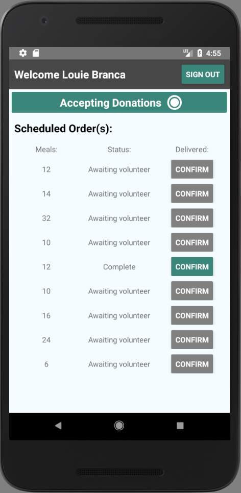

##### **Smiles is a full stack iOS and Android app that helps transport excess food to shelters in need.**

My goal was to create a mobile platform that connects Food vendors, Volunteers and Shelters together under the purpose to feed those in need.

Technologies:
* Node.JS
* React
* React Native
* Axios
* Google Maps API
* Express
* Knex
* PostgreSQL
* Heroku

## App Demo

### Demo Explanation:
* First a food vendor will sign into their account and create a new order.

* The food vendor's home page will list all of their orders which can be clicked on for more detail.

* Next a volunteer will sign in, taking them to their home page, where a list of all available orders are displayed.

* The volunteer will view the order the food vendor just created and accept it as their current order.
* The volunteer can then click on their current order to see details about the current segment as well as get a route built with google maps.
* Once the volunteer has arrived and picked up the meals they can advance the order to the next segment.
* The current order details will now be updated to take the volunteer to the point of destination.
Once they arrive to the shelter they can advance the order again.
* Finally the shelter can log in and confirm their donation has arrived.

### Challenges:

* This was my very first independent full stack application in addition to my first React and React Native app.

* Communication between users was a challenge because there was no direct link. Instead all the users talked to the database to gather information on the others. My solution was adding a refresh option that could allow for retrieval of updated information. An alternative solution would be to use a socket connect like Firebase to have data relayed to the user without the need of continuous api calls.

* This was my first time using the Google Maps API distance Matrix, and geocoding.

* Building page navigation without the use of a router, and incorporating the ability to keep track previously visited pages in order to allow for the back functionality.

### Plans for the future:

* Incorporate Firebase into my technology stack so that the database can inform user about newly built orders.

* Add React Native push notification to inform food vendors when their orders get accepted, tell volunteers about orders near them, and notify shelters when they get a new order scheduled for delivery.

* Incorporate the time estimation that the google maps API offers to provide the volunteers with more information on the orders.

* Allow for multiple stop pickup delivery by volunteers.
